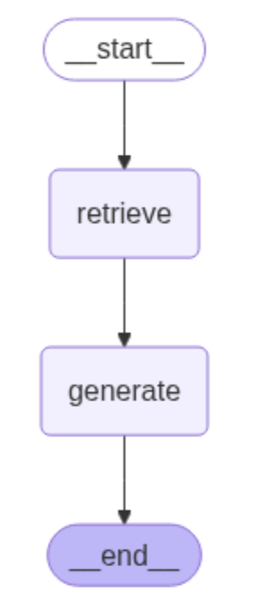

# jira-qa: A RAG system to answer your jira questions

This is a RAG system to answer your jira questions. It uses a CSV file which contains old jira tickets and their resolutions as the knowledge base, and uses OpenAI to answer your new questions.

The RAG system is orchestrated using LangGraph. The web app is run using streamlit.

## How it works

Indexing is done as a one-time job. In the runtime, it consists of Retrieval and Generation steps. It can be visualized a LangGraph graph.



### Indexing
It reads a csv file which contains old jira tickets and their resolutions. Page content of a Document object is represented by a concatenation of 'Issue', 'Description' and 'Category' fields in csv file. Chroma is used as vector store, and OpenAIEmbeddings is used as embedding.

### Retrieval
It uses similarity_search_with_relevance_scores method to get the most similar question, i.e., top 1 question and score threshold 0.15 in this implementation. In case there is no matching question, returns empty context list and a score 0. 

### Generation
It checks resolved field of the retrieved question. If flase, then answers "The retrieved issue has not been resolved yet.". Otherwise, adds the resolution field to the content as well for generation.

## How to run

### Install dependencies

```bash
uv sync
source .venv/bin/activate
```

### Start streamlit app

```bash
streamlit run main.py
```
